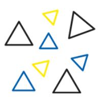
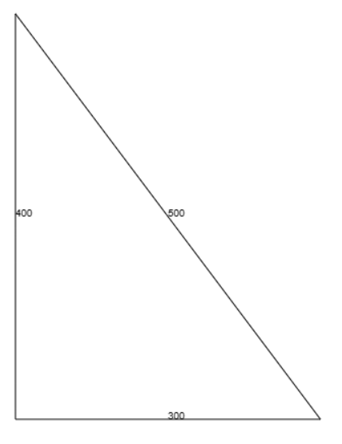
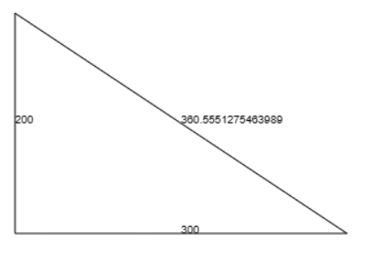

# Pythagorean triangles

Given 2 positive integers A and B, output a right triangle with 2 of the sides having A and B ems. Compute for the third side, C, and put labels on the sides as well.

#### Sample input 1
`300 400`
#### Sample output 1

#### Sample input 2
`300 200`
#### Sample output 2

## Procedure
1. Use the UI template from the sample that displays square. 
2. Copy your favicon file to your repository and make sure it shows up.
3. Place values on the meta tags, title and also place comments on your answers.
4. From index.hbs form, place an action that will call**_ draw.hbs and use the post method._**: Note: They are inside the views folder.
5. Ask for the first two sides/legs of a right triangle (the adjacent and the opposite) and they are required entries.
6. Create your express route binder in index.js/server.js (if glitch), so that when user clicks on the **_Draw Right Triangle button_**, it renders draw.hbs and the triangle is shown with correct labels.  The labels are the side lengths.  Compute for the hypotenuse given the values of the two legs. 
7. When user clicks on the Draw link without going through the Input first, please show a message that they need to click on Input first.
8. Customize your User Interface/CSS.
9. Things to study on your own by studying the following:
    - canvas tag: https://www.w3schools.com/tags/tag_canvas.asp
    - canvas properties/methods
    - .getContext()
    - width
    - height
    - .moveTo
    - .lineTo
    - .fillText()
    - .stroke()
      
## Q4 Grading 30pts.  ignore this grading system since this is a non-graded exercise already)
 - 60% javascript/ node.js program (18pts)
   - definition of express route binder for draw.hbs and reading the posted two values of the legs
   - a function that will be callled to compute for the hypotenuse
   - definition of the handlbars
   - checking whether users went through the Input link first
   - correctly defined action and method in forms
   - drawing of the actual triangle with labels
 - 30% user interface (9pts)
   - All visible names are yours
   - customized UI with title as your name and with favicon
 - 10% overall organization (3pts)
   - proper indentation of code
   - meta tags values
   - comments on the js code on both client and server side.

## Due Date
Within our double period schedule

---
